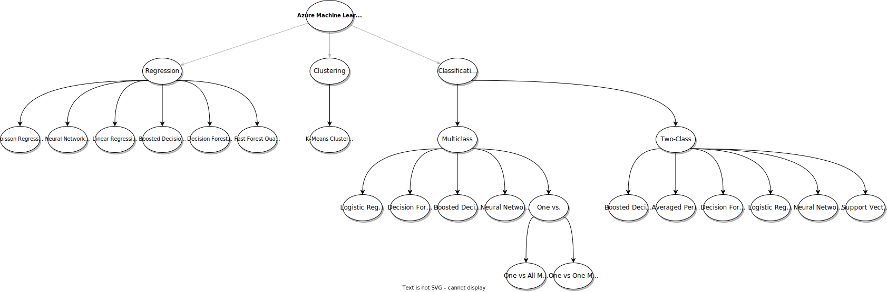

# Exam AI-900: Microsoft Azure AI Fundamentals

## Useful Links
- [Azure Machine Learning Cheat Sheet](https://docs.microsoft.com/en-us/azure/machine-learning/algorithm-cheat-sheet)

## Describe Artificial Intelligence workloads and considerations (15-20%)

### Identify features of common AI workloads
- [ ] identify prediction/forecasting workloads
    - **Prediction:**
        - Prediction and demand forecasting (relationship between visitors and sales)
        - Text prediction in Google search
        - Video streaming predicting what you would like to see next
        - Product recommendations on e-commerce site       

    | Forecasting | Prediction |
    |-------------|------------|
    | Subset of prediction problems | A broad category of machine learning |
    | Explicit introduction of time | Not necessarily time based | 
    | Forecast weather | Prediction problems used with economics |
    | Scientific, free from bias | Judgemental, biased, subjective |
    
- [ ] identify features of anomaly detection workloads
    - **Anomaly Detection :**
        - More complicated form of prediction
        - Events that fall outside of boundaries
    - Batch or real-time API
    - Detect anomalies in data with time series
        
- [ ] identify computer vision workloads
    - **Computer Vision :**
        - Face detection (with approximate ages and assumed genders)
        - Scene \ object detection. Ex: Returning a bounding box that indicates location of a vehicle in an image.
      
- [ ] identify natural language processing or knowledge mining workloads
    - **NLP (Natural Language Processing) :**
        - Understanding sentence structure
        - Inferring what question is asking
        - Knowledge Mining - Cognitive Search :
            - Related to the above.
            - Searching through multiple media types and find organization and indexing in the clutter.
           
- [ ] identify conversational AI workloads
    - **Conversational AI - Chat Bots**

### Identify guiding principles for responsible AI
- Videos from Microsoft about their AI guiding principles -> [Video Link](https://www.microsoft.com/en-us/ai/responsible-ai?activetab=pivot1%3aprimaryr6)

    

- [ ] describe considerations for **fairness** in an AI solution
    - Fundamentally a "sociotechnical" challenge
    - Require greater diversity in people creating and deploying AI solutions
    - Ultimately *reduce bias* in how AI treats people of all backgrounds
- [ ] describe considerations for **reliability and safety** in an AI solution
    - Resistant to harmful manipulations
    - Bbe safe for users
    - Consistent operation
    - Consider how to handle unusual or missing values.
- [ ] describe considerations for **privacy and security** in an AI solution
    - Provide users information and controls over the collection, storage and use of their data.
- [ ] describe considerations for **inclusiveness** in an AI solution
    - AI system that empowers everyone, including people who have hearing, visual, and other impairments.
- [ ] describe considerations for **transparency** in an AI solution
    - Transparency helps understand the data and algorithms used to train a model, data transformation logic, etc.
    - Make the model explainable.
    - Auto ML has *model explain ability*, we enable you to understand feature importance as part of automated ML runs.
- [ ] describe considerations for **accountability** in an AI solution
    - How can you use a human-led approach to drive value for your business?
    - How will your organization’s foundational values affect your approach to AI?
    - How will you monitor AI systems to ensure they are evolving responsibly?

## Describe fundamental principles of machine learning on Azure (30-35%)

### Identify common machine learning types
- [ ] identify regression machine learning scenarios
    - Predicted vs. True shows the relationship between a predicted value and its correlating true value for a regression problem.
- [ ] identify classification machine learning scenarios
- [ ] identify clustering machine learning scenarios

### Describe core machine learning concepts
- [ ] identify features and labels in a dataset for machine learning

    - **Features**: Data values that influence prediction of a model.
        - Example: if predicting fares of taxi trips, could use things like distance travelled or length of time in taxi as features.
    - The *Split Data module* is particularly useful when you need to separate data into training and testing sets. Use the Split Rows option if you want to divide the data into two parts. You can specify the percentage of data to put in each split, but by default, the data is divided 50-50.
    - [*Feature engineering*](https://docs.microsoft.com/en-us/azure/machine-learning/team-data-science-process/create-features) is used to generate additional features.
    - In Azure Machine Learning, scaling and normalization techniques are applied to facilitate feature engineering. Collectively, these techniques and feature engineering are referred to as **featurization**.

- [ ] describe how training and validation datasets are used in machine learning

    - **Labelling** : The process of tagging training data with known values.
        - Labeled data means data is marked up/annotated to identify what the ML model should predict.
    - **Validation dataset** : sample of data used to give an estimate of model skill when tuning model hyperparameters.
    - **Test dataset** : sample of data used to provide an unbiased evaluation of a final model fit on the training dataset.
    - **Unvupervised Learning** : Ability to find patterns in data without human help.
    - **Supervised Learning** : Humans label the data and give general guidance.

- [ ] describe how machine learning algorithms are used for model training

    - **Regression** : Prediction of a numeric target
    - **Classification** : Determine the category\type or class of an item or data
    - **Clustering** : Method of grouping data points into similar clusters. Also referred to as segmentation.
    - Available algorithms in Azure ML :
        - 

- [ ] select and interpret model [evaluation metrics](https://docs.microsoft.com/en-us/azure/machine-learning/studio/evaluate-model-performance) for classification and regression
    - [Machine learning metrics](https://docs.microsoft.com/en-us/dotnet/machine-learning/resources/metrics)
    
    - Regression Metrics

    | Metric | Description |
    |--------|-------------|
    | Confidence | probability score of the object classification (which you can interpret as the confidence of the predicted class being correct). |
    | Coefficient of determination (R2) | predictive power of model. 1.0 means perfect fit. Otherwise can be negative scores. |
    | RMS-loss or Root Mean Squared Error (RMSE) | measures the difference between values predicted by a model and the values observed from the environment that is being modeled. |
    | Absolute Loss | (also **Mean Absolute Error**) how close the predictions are to the actual outcomes. It is the average of all the model errors, where model error is the absolute distance between the predicted label value and the correct label value. This prediction error is calculated for each record of the test data set. Finally, the mean value is calculated for all recorded absolute errors. |
    | Squared Loss | how close a regression line is to a set of test data values by taking the distances from the points to the regression line (these distances are the errors E) and squaring them. The squaring gives more weight to larger differences. |
    
    - Classification Metrics

    | Metric | Description |
    |--------|-------------|
    | Accuracy | proportion of correctly classified instances. |
    | AUC | (True positive rate) Area under the curve measures the area under the curve created by sweeping the true positive rate vs. the false positive rate |
    | F1 Score | It's the harmonic mean of the precision and recall. F1 Score is helpful when you want to seek a balance between Precision and Recall. |

    - Precision: number of true-positives out of total guesses (tp / (tp + fp))
    - Recall: number of true-positives out of total positives (tp / (tp + fn))

### Identify core tasks in creating a machine learning solution
- [ ] describe common features of [data ingestion and preparation](https://docs.microsoft.com/en-us/azure/machine-learning/concept-data-ingestion)
    - Taking data from one or multiple sources and then preparing for training ML models.
    - Can use Azure capabilities like Azure Data Factory or Azure ML Python SDK
- [ ] describe [feature engineering](https://docs.microsoft.com/en-us/azure/machine-learning/how-to-configure-auto-features) and selection
    - It's often necessary to create additional (engineered) features that provide information to better differentiate patterns in the data.
    - Use of domain knowledge of the data is leveraged to create features that, in turn, help machine learning algorithms to learn better.
    - Includes techniques such as **normalization**, **handling missing data**, **converting text to numeric**.
- [ ] describe common features of model training and [evaluation](https://docs.microsoft.com/en-us/azure/machine-learning/component-reference/evaluate-model)
    - Training is the execution of the machine learning algorithm until a point where the error is minimized to some critical threshold.
    - Evaluation is the measurement of the model after training is complete. Various evaluation metrics are possible, including Accuracy, Precision, Recall, F1 score and AUC (area under curve).
- [ ] describe common features of model deployment and management
    - You can deploy a model and create key and endpoint for executing the model via a service call.
    - [An endpoint](https://docs.microsoft.com/en-us/azure/machine-learning/concept-endpoints) is an HTTPS endpoint that clients can call to receive the inferencing (scoring) output of a trained model.
    - Both online and batch endpoints exist.
    - A single endpoint can have multiple deployments and blue-green deployments can occur (balancing requests between instances as new model is being deployed).

### Describe capabilities of no-code machine learning with Azure Machine Learning studio
- [ ] [automated ML](https://docs.microsoft.com/en-us/azure/machine-learning/concept-automated-ml) UI

    - [**Confusion matrices**](https://docs.microsoft.com/en-us/azure/machine-learning/how-to-understand-automated-ml#confusion-matrix) provide a visual for how a machine learning model is making systematic errors in its predictions for classification models. The word "confusion" in the name comes from a model "confusing" or mislabeling samples.
        - Identifies how many times evaluated results differ from expected labels
        - Confusion matrix for a good model would show most results along the diagonal (ie most evaluations == expected labels).
        - In a *binary classification* algorithm, the concept of false negatives, true positives, true negatives and false positives exists.
            - Where the algo predicts a positive (1) and the actual is also positive (1) then it is a true positive.
            - if predicts negative (0) and actual is positive (1) then it is a false negative (falsely predicting negative).
            - if predicts positive and actual negative, then false positive.
            - if predicts negative and actual negative, then true negative.
            - [See this article](https://docs.microsoft.com/en-us/previous-versions/azure/machine-learning/classic/evaluate-model-performance#inspecting-the-evaluation-results-1).

- [ ] azure Machine Learning designer
    - Lets you visually connect datasets and modules on an interactive canvas to create machine learning models.
    - Can connect modules to create a pipeline draft and this can be published.
    - To consume a published pipeline, use the authentication key and REST endpoint.
    - Real-time endpoints need to be deployed to AKS. [https://docs.microsoft.com/en-us/azure/machine-learning/concept-designer#deploy](See here).
    - Designer modules (for Data Preparation) :
    
    | Category | Description | Example Components \ Modules |
    |--------|-------------|--------------------------------|
    | Data Input and Outpue | Move data into pipeline | Enter data manually, export, import |
    | Data Transformation | Transform the data | Add rows, apply math op, clean missing data, clip values, group into bins, **normalize**, **join data**, **remove duplicate rows**, select columns, split data |
    | Feature Selection | Select subset of features | Filter based, permutation, feature importance |
    | Statistical functions | Provides statistical methods | Summarize data |

## Describe features of computer vision workloads on Azure (15-20%)

### Identify common types of computer vision solution:
- [ ] identify features of image classification solutions
- [ ] identify features of object detection solutions
    - **Semantic segmentation** achieves fine-grained inference by making dense predictions inferring labels for every pixel, so that each pixel is labeled with the class of its enclosing object ore region.
- [ ] identify features of optical character recognition solutions

    - [**Form Recognizer**](https://azure.microsoft.com/en-us/services/cognitive-services/form-recognizer/) : extract text, key/value pairs and tables from documents.
        - Examples:
            - Scan receipt and extract subtotals.
   
- [ ] identify features of facial detection, facial recognition, and facial analysis solutions

    - [**Face Service**](https://docs.microsoft.com/en-us/azure/cognitive-services/face/overview) : provides AI algorithms that detect, recognize, and analyze human faces in images.
        - Examples:
            - Identity verification
            - Touchless access control
            - Face redaction
        - Returns rectangle coordinates of faces locations. Also returns unique ID that represents stored face data.
            - Optionally can extract set of face-related attributes : head pose, age, emption, facial hair and glasses.
        - Use for face identification or face matching (verification)
        - Benefits from having multiple angles of a face per person for increased accuracy

### Identify Azure tools and services for computer vision tasks
- [ ] identify capabilities of the Computer Vision service

    - A specific resource for the Computer Vision service.
    - Returns bounding box, image class name and probability score
    - The **OCR API** is designed for quick extraction of small amounts of text in images.
    - [The **Read API**](https://westus.dev.cognitive.microsoft.com/docs/services/computer-vision-v3-2/operations/5d986960601faab4bf452005):
        - For text-heavy images and multi-page, mixed language, and mixed type documents.
        - Asynchronous
        - Supports numerous image types
        - The file size must be less than 50 MB
        - Supports 164 languages for print text and 9 languages for handwritten
    
- [ ] identify capabilities of the [Custom Vision](https://docs.microsoft.com/en-us/azure/cognitive-services/custom-vision-service/overview) service

    - Azure Custom Vision is an image recognition service that lets you build, deploy, and improve your own image identifier models.
    - Unlike the Computer Vision service, Custom Vision allows you to specify your own labels and train custom models to detect them.
    - 2 categories
        1. Object detection
        2. Image classification
            - Need to select either multilabel (multiple tags per image) or multiclass (single tag per image)
        - Both catagories can select from a variety of different domains.
        
    - To use, requires prediction key, endpoint, model name and project id

- [ ] identify capabilities of the Face service
- [ ] identify capabilities of the Form Recognizer service

## Describe features of Natural Language Processing (NLP) workloads on Azure (15-20%)

### Identify features of common NLP Workload Scenarios
- [ ] identify features and uses for key phrase extraction
- [ ] identify features and uses for entity recognition
- [ ] identify features and uses for sentiment analysis
- [ ] identify features and uses for language modeling
- [ ] identify features and uses for speech recognition and synthesis
- [ ] identify features and uses for translation

### Identify Azure tools and services for NLP workloads
- [ ] identify capabilities of the Text Analytics ([Language](https://docs.microsoft.com/en-us/azure/cognitive-services/language-service/)?) service

    - Classify text, sentiment analysis, language detection, key phrases
    - Sentiment analysis : scores between 0.0 (negative) and 1.0 (positive sentiment). 
- [ ] identify capabilities of the Language Understanding service (LUIS)
    - Superseded by Cognitive Services Language?
    - 4 types of entities can be created:
        - Machine Learned
        - Regex
        - Pattern.any
        - List
    - Also capable of sentiment analysis

    - Capabilities of Cognitive Service for Language :

    | Capability | Description | Development Options |
    |------------|-------------|---------------------|
    | Named Entity Recognition (NER)	| Identifies entities in text across several categories.| Language studio, REST, SDK |
    | Personally Identifiable Information (PII) detection |	Identifies entities in text across several categories of sensitive information (ex. account information). | Language studio, REST, SDK |
    | Key phrase extraction |	Evaluates unstructured text - for each input document, returns a list of key phrases and main points. | Language studio, REST, SDK, Docker |
    | Entity linking | Disambiguates identity of an entity in text - provides links to the entity on Wikipedia. | Language studio, REST, SDK |
    | Text Analytics for health | Extracts information from unstructured medical texts (clinical notes and doctor's notes). | Language studio, REST, SDK, Docker |
    | Custom NER | Build an AI model to extract custom entity categories, using unstructured text that you provide. | Language studio, REST |
    | Analyze sentiment and opinions | Provides sentiment labels ("negative", "neutral", "positive") for sentences and documents. Additionally can provide granular information about opinions related to words that appear in the text. | Language studio, REST, SDK, Docker |
    | Language detection | Evaluates text, and determines the language it was written in. It returns a language identifier and a score that indicates the strength of the analysis. | Language studio, REST, SDK, Docker | 
    | Custom text classification (preview) | Build an AI model to classify unstructured text into custom classes that you define. | Language studio, REST |
    | Text Summarization (preview) | Extracts key sentences that collectively convey the essence of a document. | Language studio, REST |
    | Conversational language understanding (preview) |	Build an AI model to bring the ability to understand natural language into apps, bots, and IoT devices. | Language Studio |
    | Question answering | Provides answers to questions extracted from text input, using semi-structured content such as: FAQs, manuals, and documents. | Language studio, REST, SDK |
    | Orchestration workflow | Train language models to connect your applications to question answering, conversational language understanding, and LUIS | Language studio, REST |

- [ ] identify capabilities of the Speech service
    
    | Capability | Description | Development Options |
    |------------|-------------|---------------------|
    | Speech-to-text | Real-time, batch, multi-device conversation, transcription, custom models, pronunciation assessment | SDK, REST |
    | Text-to-speech | Pre-built neural voices, custom neural-voices | SDK, REST |
    | Speech translation | Speech translation enables real-time, multilanguage translation of speech to your applications, tools, and devices. Use this feature for speech-to-speech and speech-to-text translation. | SDK | 
    | Language Identification | Language identification is used to identify languages spoken in audio when compared against a list of supported languages. Use language identification by itself, with speech-to-text recognition, or with speech translation. | SDK | 
    | Voice Assistant | Voice assistants using the Speech service empower developers to create natural, humanlike conversational interfaces for their applications and experiences. The voice assistant feature provides fast, reliable interaction between a device and an assistant implementation that uses the Bot Framework's Direct Line Speech channel or the integrated custom commands service for task completion. | SDK | 
    | Speaker Recognition | Speaker recognition provides algorithms that verify and identify speakers by their unique voice characteristics. Speaker recognition is used to answer the question, "Who is speaking?". | SDK, REST |
    

- [ ] identify capabilities of the [Translator Text service](https://docs.microsoft.com/en-us/azure/cognitive-services/translator/translator-overview)
    | Capability | Description | Development Options |
    |---------|-------------|---------------------|
    | Text Translation | Execute text translation between supported source and target languages in real time.	| REST API, Docker Container |
    | Document Translation | Translate batch and complex files while preserving the structure and format of the original documents.	 | REST API, SDK |
    | Custom Translator | Build customized models to translate domain- and industry-specific language, terminology, and style.	| Translator Portal |
    

## Describe features of conversational AI workloads on Azure (15-20%)

### Identify common use cases for conversational AI
- [ ] identify features and uses for webchat bots

    - Examples :
        - Webchat for customer support. Reduces customer support call volume to support persons.

- [ ] identify common characteristics of conversational AI solutions

### Identify Azure services for conversational AI
- [ ] identify capabilities of the QnA Maker service
- [ ] identify capabilities of the Azure Bot service
    - Bot service [**skills**](https://microsoft.github.io/botframework-solutions/overview/skills/) can be used to extend capabilities of the bot
