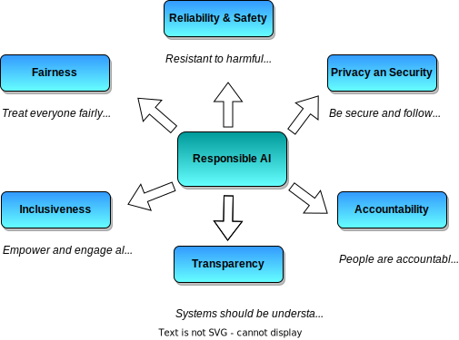

# Exam AI-900: Microsoft Azure AI Fundamentals

## Describe Artificial Intelligence workloads and considerations (15-20%)

### Identify features of common AI workloads
- [ ] identify prediction/forecasting workloads
- [ ] identify features of anomaly detection workloads
- [ ] identify computer vision workloads
- [ ] identify natural language processing or knowledge mining workloads
- [ ] identify conversational AI workloads

### Identify guiding principles for responsible AI
- Videos from Microsoft about their AI guiding principles -> [Video Link](https://www.microsoft.com/en-us/ai/responsible-ai?activetab=pivot1%3aprimaryr6)

    

- [ ] describe considerations for **fairness** in an AI solution
    - Fundamentally a "sociotechnical" challenge
    - Require greater diversity in people creating and deploying AI solutions
    - Ultimately reduce bias in how AI treats people of all backgrounds
- [ ] describe considerations for **reliability and safety** in an AI solution
    - Resistant to harmful manipulations
    - be safe for users
- [ ] describe considerations for **privacy and security** in an AI solution
- [ ] describe considerations for **inclusiveness** in an AI solution
- [ ] describe considerations for **transparency** in an AI solution
- [ ] describe considerations for **accountability** in an AI solution

## Describe fundamental principles of machine learning on Azure (30-35%)

### Identify common machine learning types
- [ ] identify regression machine learning scenarios
- [ ] identify classification machine learning scenarios
- [ ] identify clustering machine learning scenarios

### Describe core machine learning concepts
- [ ] identify features and labels in a dataset for machine learning
- [ ] describe how training and validation datasets are used in machine learning
- [ ] describe how machine learning algorithms are used for model training
- [ ] select and interpret model evaluation metrics for classification and regression

### Identify core tasks in creating a machine learning solution
- [ ] describe common features of data ingestion and preparation
- [ ] describe feature engineering and selection
- [ ] describe common features of model training and evaluation
- [ ] describe common features of model deployment and management

### Describe capabilities of no-code machine learning with Azure Machine Learning studio
- [ ] automated ML UI
- [ ] azure Machine Learning designer

## Describe features of computer vision workloads on Azure (15-20%)

### Identify common types of computer vision solution:
- [ ] identify features of image classification solutions
- [ ] identify features of object detection solutions
- [ ] identify features of optical character recognition solutions
- [ ] identify features of facial detection, facial recognition, and facial analysis solutions

### Identify Azure tools and services for computer vision tasks
- [ ] identify capabilities of the Computer Vision service

    - A specific resource for the Computer Vision service.
    - Returns bounding box, image class name and probability score
    - The **OCR API** is designed for quick extraction of small amounts of text in images.
    - [The **Read API**](https://westus.dev.cognitive.microsoft.com/docs/services/computer-vision-v3-2/operations/5d986960601faab4bf452005):
        - For text-heavy images and multi-page, mixed language, and mixed type documents.
        - Asynchronous
        - Supports numerous image types
        - The file size must be less than 50 MB
        - Supports 164 languages for print text and 9 languages for handwritten
- [ ] identify capabilities of the Custom Vision service
    - Azure Custom Vision is an image recognition service that lets you build, deploy, and improve your own image identifier models.
    - Unlike the Computer Vision service, Custom Vision allows you to specify your own labels and train custom models to detect them.
    - 2 categories
        1. Object detection
        2. Image classification
    - To use, requires prediction key, endpoint, model name and project id
- [ ] identify capabilities of the Face service
- [ ] identify capabilities of the Form Recognizer service

## Describe features of Natural Language Processing (NLP) workloads on Azure (15-20%)

### Identify features of common NLP Workload Scenarios
- [ ] identify features and uses for key phrase extraction
- [ ] identify features and uses for entity recognition
- [ ] identify features and uses for sentiment analysis
- [ ] identify features and uses for language modeling
- [ ] identify features and uses for speech recognition and synthesis
- [ ] identify features and uses for translation

### Identify Azure tools and services for NLP workloads
- [ ] identify capabilities of the Text Analytics ([Language](https://docs.microsoft.com/en-us/azure/cognitive-services/language-service/)?) service
    - Classify text, sentiment analysis, language detection, key phrases
    - Sentiment analysis : scores between 0.0 (negative) and 1.0 (positive sentiment). 
- [ ] identify capabilities of the Language Understanding service (LUIS)
    - Superseded by Cognitive Services Language?
    - 4 types of entities can be created:
        - Machine Learned
        - Regex
        - Pattern.any
        - List
    - Also capable of sentiment analysis
- [ ] identify capabilities of the Speech service
- [ ] identify capabilities of the Translator Text service

## Describe features of conversational AI workloads on Azure (15-20%)

### Identify common use cases for conversational AI
- [ ] identify features and uses for webchat bots
- [ ] identify common characteristics of conversational AI solutions

### Identify Azure services for conversational AI
- [ ] identify capabilities of the QnA Maker service
- [ ] identify capabilities of the Azure Bot service
    - Bot service [**skills**](https://microsoft.github.io/botframework-solutions/overview/skills/) can be used to extend capabilities of the bot
