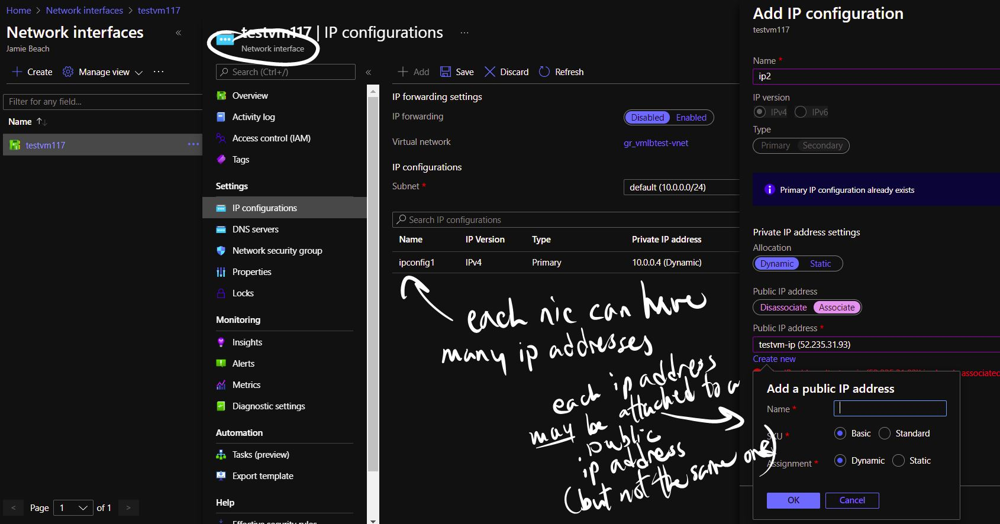
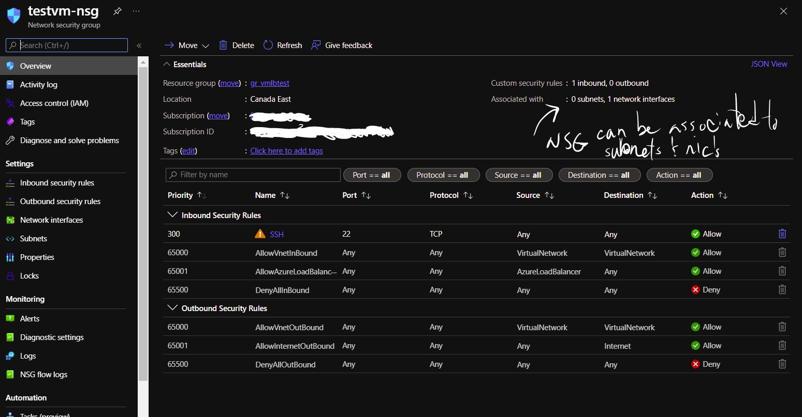

# AZ-104 Microsoft Azure Administrator Certification Cheat Sheet

[Exam Outline](https://query.prod.cms.rt.microsoft.com/cms/api/am/binary/RE4pCWy)

## 🔖 Manage Azure identities and governance (15–20%)

### AD (Active Directory) vs AAD (Azure Active Directory)
- Fundamental differences : REST API vs NTLM\Kerberos\LDAP. Also Group Policy Object vs Intune
- Hybrid AD-AAD use **AD Connect** - Hash sync, pass-through auth (PTA), Federation
- [Built-in **AAD Roles**](https://docs.microsoft.com/en-us/azure/active-directory/roles/permissions-reference) : examples: *global admin*, *user admin*, *billing admin*
  - Global Admin: can reset all passwords / elevated access. Can grant admin roles. On root (above Management Groups)
- [Join Types](https://o365blog.com/post/devices/#join-types): 
  - Registered (personal device - non organization account)
  - Joined (organizatino device, sign-in w Azure AD account - cloud only)
  - Hybrid Joined (organization device, Active Directory Domain Services account - both on-prem and cloud)
- [Dynamic Group](https://docs.microsoft.com/en-us/azure/active-directory/enterprise-users/groups-create-rule) : O365 group - When an attribute changes for a user or device, all dynamic group rules in the organization are processed for membership changes.
- [Administrative Units](https://docs.microsoft.com/en-us/azure/active-directory/roles/administrative-units) - AD resource that contains other AD resources (users/groups)
- [Identity Governance](https://docs.microsoft.com/en-us/azure/active-directory/governance/identity-governance-overview)
- SSPR (Self-serve password reset). Administrators have strong 2-gate password reset always, which may differ from configured SSPR policies.
- [Conditional Access Policy](https://docs.microsoft.com/en-us/azure/active-directory/conditional-access/overview) : Conditional Access policies at their simplest are if-then statements, if a user wants to access a resource, then they must complete an action. Uses "signals" to make decisions. ex. members of the group need to use MFA and an Azure AD-joined device when they connect to Azure AD from untrusted locations.
- [MFA Auth Provider](https://docs.microsoft.com/en-us/azure/active-directory/authentication/concept-mfa-authprovider): MFA usage model. 2 Types - per-authentication and per-user. Usage model can't be changed after created.
- [Azure AD Connect Sync](https://docs.microsoft.com/en-us/azure/active-directory/hybrid/how-to-connect-sync-feature-scheduler): synchronize changes occurring in your on-premises directory using a scheduler

### Azure RBAC (Role-Based Access Control)
- Follow least privileges policy : Grant narrow access for role
- Uses Azure Resource Manager for fine-grained authorization control within set scope (resouces)
- **Security Principal** - like a service account or managed identity for resource access
- **Role Definition** - list of ops that can be performed
- **Scope** - set of resources for access. Follows parent-child relationship in scope hierarchy
- Role assignments can be *Allow* or *Deny*
- RBAC is free with Azure subscriptions
- [Built-in roles](https://docs.microsoft.com/en-us/azure/role-based-access-control/built-in-roles) : *owner*, *contributor*, *reader*, *user access administrator*. Also specialized roles (ex. Network Contributor)

### Azure Policy
- Free. Define\assign\manage standards (like ISO\HIPPA\GDPR) for resources
- Mark actions and setup as non-compliant
- Policy Definition -> Policy Initiative -> Policy\Initiative Assignment
- **Initiative** is a set of policy definitions, grouped together. (ex. all billing policies in an initiative)

### [Azure Blueprints](https://cloudacademy.com/blog/what-are-azure-blueprints/)
- Build and deploy collections of Azure resources adhering to requirements and standards
- Includes role assignments, resource groups, policy assignments, etc..
- Used by admins and architects to design solutions
- Similar to ARM templates, but exist natively on Azure

### Azure Advisor
- 5 pilars : "Azure well-architected framework"
  - Cost optimization, Operational excellence, Performance efficiency, Security, Reliability

### Azure Service Health
- Personalized dashboard for ssubscription - all resources across all subscriptions and regions
- Notifications of issues or upcoming maintenance

### Scopes
Root -> Management Groups -> Subscriptions -> Resource Groups -> Resources

### Resouce Manager
- Handles deployments of resources

### Scaling

| SLA   | Scaling type |
| ----- | ------------------------------------------ |
| 99.9% | Single VM (with Premium SSD or Ultra Disk) |
| 99.95% | Availability Set |
| 99.99% | Availability Zones |

- Availability Sets spread load over multiple fault domains, but have no defined SLA besides the underlying VM SLA's. 3 Fault Domains and up to 20 Update domains.

### Azure Key Vault
- Integrated into AD - store secrets, keys and certificates (w multiple versions)
- [FIPS 140-2 compliant](https://csrc.nist.gov/publications/detail/fips/140/2/final)
- Set access policies or RBAC for data plane. Management plane RBAC only.

### Locks
- Locks can be put on resources. 
- Delete and read-only locks on a resource do not prevent it from being moved.

### [System Center Service Manager](https://docs.microsoft.com/en-us/system-center/scsm/?view=sc-sm-2019)
- Service Manager provides an integrated platform for automating and adapting your organization's IT service management best practices.
- [ITSM](https://docs.microsoft.com/en-us/azure/azure-monitor/alerts/itsmc-overview)
- IT Service Management Connector (ITSMC) allows you to connect Azure to a supported IT Service Management (ITSM) product or service.
- ex. MS System Center Service Manager or IBM ServiceNow

## 🔖 Implement and manage storage (15–20%)

### Azure Storage

- Azure Import/Export service is used to securely import large amounts of data to Azure Blob storage and Azure Files by shipping disk drives to an Azure datacenter.

#### Azure BLOB Storage
- binary/text data
- [REST API](https://docs.microsoft.com/en-us/rest/api/storageservices/blob-service-rest-api)\CLI\ARM
- Common for backup\restore\largef files\logging
- [ADLS (Azure Data Lake)](https://docs.microsoft.com/en-us/azure/architecture/data-guide/scenarios/data-lake) is on Blob Storage
- [Types](https://docs.microsoft.com/en-us/rest/api/storageservices/understanding-block-blobs--append-blobs--and-page-blobs): 
  - Block:  large objects \ optimal for streaming. Up to 190.7 TiB
  - Append: keep updating to files (ex logging)
  - [Page](https://docs.microsoft.com/en-us/azure/storage/blobs/storage-blob-pageblob-overview?tabs=dotnet): collection of 512-byte pages for read/write arbitrary byte ranges. Optimal for data structures like OS and data disk images. ex Azure SQL DB. Up to 8 TiB
- Access levels: Private, Blob (anon read), Container (anon read for container and blob)
- [Access tiers](https://docs.microsoft.com/en-us/azure/storage/blobs/access-tiers-overview): Hot/Cool and Archive (Cool - between 30 and 180 days storage)
- Zone replication: 

| . | **LRS** | **ZRS** | **GRS/RA-GRS** | **GZRS/RA-GZRS** |
| -- | ------ | ------- | -------------- | ---------------- |
| Node outage        | ✅ | ✅ | ✅ | ✅ |
| Data center outage |   | ✅ | ✅ | ✅ |
| Region-wide outage |   |    | ✅ | ✅ |

- **For RA- variants read access for secondary region is available regardless if primary region goes down*
- Lifecycle management: moving between hot\cool\archive
- [Storage accounts overview](https://docs.microsoft.com/en-us/azure/storage/common/storage-account-overview)

#### Azure File Storage
- File share accessible over [SMB](https://docs.microsoft.com/en-us/previous-versions/windows/it-pro/windows-server-2012-r2-and-2012/hh831795(v=ws.11)) or [NFS](https://docs.microsoft.com/en-us/windows-server/storage/nfs/nfs-overview)
  - UNC path mounted with File Explorer : \\host-name.file.core.windows.net\share-name\file-name
- [Azure File Sync](https://docs.microsoft.com/en-us/azure/storage/file-sync/file-sync-deployment-guide?tabs=azure-portal%2Cproactive-portal) : sync Azure file share with a local computer.
  - Deploy Sync service to Azure sub, install Azure File Sync Agent on local computer, Register Windows Server with Storage Sync Service, Create a Sync Group and Cloud Endpoint, Create a Server Endpoint.
  - Has simple conflict-resolution strategy for duplicate filenames : most recent change keeps filename. Older file has endpoint name and conflict number appended to filename. ex.. FilenameWithoutExtension-endpointName-#.ext (number only for when more than one conflict.)
- SAS (Shared Access Token) : available on container - a URI that grants restricted access to an Azure Storage container. Can specify time period for access as well as allowed ip address ranges.

#### Azure Disk Storage
- .vhd virtual VM disks (and images) are stored in Page BLOB's.
- Managed disks preferred for VM data or OS disks (don't have to setup or manage the storage account)
  - Standard HDD, Standards SSD, Premium SSD, Ultra SSD (Cannot be used for OS disk, only data disk)
- Azure Backup takes snapshots for backups

#### Azure Queue Storage
- Simple, cheap message and queue storage
- Limits:
  - queue size 500GB
  - message size 64KB

#### Azure Table Storage
- Simple NoSQL db (key-value)
- Petabyte limits
- Highly available

#### Azure Archive Storage
- Use for archived (super low frequency access)
- 180 day minimum data retention
- High fee disk operations

## 🔖 Deploy and manage Azure compute resources (20–25%)

### Azure VM's
- SLA is combo of number of VM's and disk types used.
- 2 VM's across 2 or more availability zones for 99.99
- 2 VM's in availability set 99.95
- single VM w premium disk is 99.9
- **reserved instances** - paying up-front for specified period (1y or 3y)
- Can upload custom images (.vhd file) with powershell command Add-AzVhd
- Configure static VM ip addresses with [Set-AzNetworkInterface powershell commandlet](https://docs.microsoft.com/en-us/powershell/module/az.network/set-aznetworkinterface?view=azps-7.2.0&viewFallbackFrom=azps-6.5.0) (or Set-AzureStaticVNetIP for classic resources).
- Creating ip addresses: each VM requires a NIC. Each NIC can provide a private ip address. Public ip addresses are separate to the NIC iteself (the VM is not really aware of the public IP address).

  

### App Service
- For web sites and REST services
- Multiple language\runtime support

### [Azure Container Registry](https://docs.microsoft.com/en-us/azure/container-registry/container-registry-intro)
- Azure Container Registry is a managed, private Docker registry service based on the open-source Docker Registry 2.0.
- Basic, Standard and Premium tiers
- "Content Trust" - option to enable signing images with certificate

### Azure Container Instance
- Can run isolated containers, but not the more sophisticated features of AKS (orchestration, auto-scaling, etc)
- Cannot expose both UDP and TCP on same port

### Azure Kubernetes Service (AKS)
- Containerization: containers contain both application and OS, along with all dependencies, as a single file\asset
- Orchestration: the system used to manage\deploy the containers
- Cluster contains a **control plane** and the nodes used to run applications
- A **persistent volume** is data storage from outside the AKS cluster
- Pod replicas for scaling
- **Ingress** - open comm channel into cluster\app
- Numerous ways to provide users access to k8s cluster in AKS: https://docs.microsoft.com/en-us/azure/aks/concepts-identity (including AD client application with oauth 2)

## 🔖 Configure and manage virtual networking (25–30%)

### [Virtual Network](https://docs.microsoft.com/en-us/azure/virtual-network/virtual-networks-overview)
- Azure Virtual Network (VNet) is the fundamental building block for your private network in Azure.
- All resources in a VNet can communicate outbound to the internet, by default. 
- Can assign a public ip address to communicate inbound from internet
- Allow vnets to communicate to each other through vnet pairing
  - vnet pairing can be local, between vnets in same region, or global across regions.
  - The only real constraint for vnet peering is address space, in vnet address space cannot overlap.
  - Peering using a vnet-to-vnet VPN Gateway also requires a dedicated subnet with address space /27 or /28. If a subnet existing in vnet already occupies address space then vnet-to-vnet VPN gateway can't be created. Requires resizing subnet address space.
- A **subnet** is a sub-component of a vnet and resources can be access restricted at a subnet level.
  - A subnet will lose 5 ip addresses of the selected ip range for default required addresses - (0, 1,2,3,255)
- If VNet A is peered with VNet B and VNet B is peered with VNet C, it does _not_ mean that VNet A can talk to VNet C.
- A [Virtual Network service endpoint](https://docs.microsoft.com/en-us/azure/virtual-network/virtual-network-service-endpoints-overview) provides secure connectivity to Azure services over an optimized route over backbone network. Allows private IP addresses in VNet to reach endpoint of an Azure service without needing a public IP address in VNet.
- [Private Link](https://docs.microsoft.com/en-us/azure/private-link/private-link-overview) : enables access to Azure PaaS services (ex. storage, SQL) and Azure hosted customer-owned/partner services over a [private endpoint](https://docs.microsoft.com/en-us/azure/private-link/private-endpoint-overview) in Vnet.
- Private Endpoint allows private connectivity (no public ip address) for Azure services like Azure Storage, Cosmos DB, SQL, etc...
- Video: [Service endpoints vs Private endpoints](https://www.youtube.com/watch?v=4v-9zGHxVeI)

### [Network Security Groups](https://docs.microsoft.com/en-us/azure/virtual-network/network-security-groups-overview#network-security-groups)
- contain multiple inbound and outbound security rules that enable you to filter traffic to and from resources by source and destination IP address, port, and protocol.
- Each network interface or subnet can have an NSG. But only one NSG is needed across multiple resources in a vnet.

  

### Load Balancers
- Load balancer works at [Layer 4](https://www.nginx.com/resources/glossary/layer-7-load-balancing/)
- Basic LB - underlying VM's need to be in an availability set, Standard LB - no availabilty set required
- Standard LB requires Standard public network interface on VM
- LB's require VM's in same virtual network
- [Floating IP](https://docs.microsoft.com/en-us/azure/load-balancer/load-balancer-floating-ip)
- [Availability Sets](https://docs.microsoft.com/en-us/azure/load-balancer/tutorial-multi-availability-sets-portal): only apply to VM's. Takes the virtual machine and configures multiple copies of it. Each copy is isolated within a separate physical server, compute rack, storage units and network switches within a single datacentre within an Azure Region. ([tutorial](https://docs.microsoft.com/en-us/azure/virtual-machines/windows/tutorial-availability-sets))

### Application Gateway
- [Layer 7](https://www.nginx.com/resources/glossary/layer-7-load-balancing/)
- Route based on URL and other attributes.

### Network Verification
- [IP Flow Verify](https://docs.microsoft.com/en-us/azure/network-watcher/network-watcher-ip-flow-verify-overview#:~:text=IP%20flow%20verify%20checks%20if,denied%20the%20packet%20is%20returned.): checks if a packet is allowed or denied to or from a virtual machine
- Network Watcher Connection Monitor:  provides unified end-to-end connection monitoring in Azure Network Watcher. Notifies changes in "reachability" and latency.
- Network Configuration Diagnostic Tool: understand which traffic flows will be allowed or denied in your Azure Virtual Network
- Network Watcher Next Hop: Checking if traffic is being directed to the intended destination.

### Point-to-Site VPN
- Established between a virtual network and a single computer in your network. Each computer that wants to establish connectivity with a virtual network must configure its connection.
- Note that after changing topology of network (ex. add vnet peering to another vnet) the VPN client configuration software must be re-downloaded and re-installed. [See here](https://docs.microsoft.com/en-us/azure/vpn-gateway/vpn-gateway-about-point-to-site-routing)

### Site-to-Site VPN
- Established between your on-premises VPN device and an Azure VPN Gateway that is deployed in a virtual network. This connection type enables any on-premises resource that you authorize to access a virtual network. The communication between your on-premises VPN device and an Azure VPN gateway is sent through an encrypted tunnel over the internet

### Express Route
- Established between your network and Azure, through an ExpressRoute partner. This connection is private

### Azure Firewall

## 🔖 Monitor and back up Azure resources (10–15%)

### [Azure Monitor](https://docs.microsoft.com/en-us/azure/azure-monitor/alerts/alerts-log)
- [Log Analytics](https://docs.microsoft.com/en-us/azure/azure-monitor/logs/log-analytics-tutorial) - edit and run log queries from Azure Monitor logs.
  - Can search using [Log Analytics Query Language](https://docs.microsoft.com/en-us/services-hub/health/log_analytics_query_language)
  - ex. **search in (Event) "error"**
- [Log alerts](https://docs.microsoft.com/en-us/azure/azure-monitor/alerts/alerts-log) can be created by creating a new Alert Rule and then setting alerting action.

### [Recovery Services Vault](https://docs.microsoft.com/en-us/azure/backup/backup-azure-recovery-services-vault-overview)
- A storage entity to house copies of data, config for VMs, workloads, servers or workstations.
- Can be used to hold backup data for various Azure services such as IaaS VMs and Azure SQL databases.
- Not for BLOB data (BLOB requires backup vault)
- Support System Center DPM, Windows Server, Azure Backup Server and more.
- Soft delete - (available on data protection tab of storage account resource) backups retained for additional 14 days allowing for recovery.
- Default backup policy is once per day. Backups retained for 30 days. Instant recovery snapshots retained for two days.
- Can backup only VMs in same region and subscription as that of the vault.
- If you create a custom VM or migrate from on-prem (ie. not from marketplace) you may need to install the VM agent manually.
- [Azure backup support matrix](https://docs.microsoft.com/en-us/azure/backup/backup-support-matrix-iaas)

### [Backup Vault](https://docs.microsoft.com/en-us/azure/backup/backup-vault-overview)
- 
### [Application Insights](https://docs.microsoft.com/en-us/azure/azure-monitor/app/app-insights-overview)
- Feature of Azure Monitor that provides extensible application performance management (APM) and monitoring of live web apps.
  - Request rates, response times, failure rates
  - User journey things - popular pages, where users are, page performance, struggles
  - Aggreagted statistics or specific instances\stack trace
  - Page views and performance
  - VM performance counters
  - Host diagnostics  or docker\Azure
  - Trace logs, etc
- Sort of like a combination of New Relic and Google Analytics
- Maps and telemetry data
- [Application Insights Funnels](https://docs.microsoft.com/en-us/azure/azure-monitor/app/usage-funnels) - user progress through series of steps in web application
- [Impact Analysis](https://docs.microsoft.com/en-us/azure/azure-monitor/app/usage-impact) analyzes load times and other properties influencing conversion rates.
- [Retention Analysis](https://docs.microsoft.com/en-us/azure/azure-monitor/app/usage-retention) helps to analyze how many users return to the app.
- [User Flows](https://docs.microsoft.com/en-us/azure/azure-monitor/app/usage-flows) tool visualizes how users navigate between pages and features of site.
